# Schema

Maestro postgres db schema

The entity-relationship diagram provides a visual representation of the database schema used to track off-chain data for interchain tokens and their deployment across different blockchain networks. This schema is crucial for tracking the lifecycle and management of tokens that operate both on the origin chain and on remote chains. Here's a breakdown of the key entities and their relationships:

### Entities

1. **INTERCHAIN_TOKENS**: Represents tokens deployed on the origin chain. Attributes include token identity, address, chain ID, name, symbol, decimals, and deployment-related information. Special attributes like `kind` and `salt` are used to handle different token types and their deployment mechanisms.

2. **REMOTE_INTERCHAIN_TOKENS**: Tracks tokens deployed on remote chains, linking back to their origin token representation. It includes a unique identifier, token and chain IDs, token address, and deployment status among other attributes.

3. **AUDIT_LOGS**: Stores audit logs for security-related events. Each log entry includes an event kind, payload, and timestamp to ensure thorough tracking of activities.

### Relationships

- **INTERCHAIN_TOKENS to REMOTE_INTERCHAIN_TOKENS**: A one-to-many relationship, indicating that one token on the origin chain can have multiple representations (deployments) on remote chains.

- **REMOTE_INTERCHAIN_TOKENS to INTERCHAIN_TOKENS**: A many-to-one relationship, allowing each remote token to trace back to its original token on the origin chain.

### Fields Formatting

Fields like `tokenId`, `tokenAddress`, and `axelarChainId` follow specific formatting rules, such as the inclusion of a `0x` prefix for hexadecimal strings or specific length requirements. This ensures consistency and ease of tracking across different blockchain networks.

### Enumerations

Several fields utilize enumerated types (`ENUMs`) to restrict values to a predefined set, facilitating validation and consistency for attributes like `tokenManagerType` and `deploymentStatus`.

```mermaid
erDiagram
    INTERCHAIN_TOKENS {
        string tokenId PK "Primary Key, Format: 0x${string} (HASH_LENGTH)"
        string tokenAddress "Not Null, Format: ${string}"
        string axelarChainId "Not Null, Format: ${string} (HASH_LENGTH)"
        string tokenName "Not Null, Max: 100"
        string tokenSymbol "Not Null, Max: 100"
        int tokenDecimals "Not Null"
        string deploymentMessageId "Not Null, Format: ${string}-${number}"
        string deployerAddress "Not Null, Format: 0x${string}"
        string tokenManagerAddress "Not Null, Format: 0x${string}"
        string tokenManagerType "ENUM(TOKEN_MANAGER_TYPES)"
        string originalMinterAddress "Format: 0x${string}"
        string kind "Not Null, ENUM(token_kind)"
        datetime createdAt "Default: Now"
        datetime updatedAt "Default: Now"
        string salt "Not Null, Default: 0x, Only for kind=interchain|custom"
    }

    REMOTE_INTERCHAIN_TOKENS {
        string id PK "Primary Key, Format: ${axelarChainId}:${tokenAddress}"
        string tokenId FK "Not Null, References INTERCHAIN_TOKENS"
        string axelarChainId "Not Null, Format: ${string} (HASH_LENGTH)"
        string tokenAddress "Not Null, Format: 0x${string}"
        string tokenManagerAddress "Format: 0x${string}"
        string tokenManagerType "ENUM(TOKEN_MANAGER_TYPES)"
        string deploymentMessageId "Not Null, Format: ${string}-${number}"
        string deploymentStatus "Default: pending, ENUM(deployment_status)"
        datetime createdAt "Default: Now"
        datetime updatedAt "Default: Now"
    }

    AUDIT_LOGS {
        uuid id PK "Primary Key, Default: Random"
        string eventKind "Not Null, ENUM(audit_log_event_kind)"
        string payload "Not Null, Max: 2048"
        datetime timestamp "Not Null, Default: Now"
    }

    INTERCHAIN_TOKENS ||--o{ REMOTE_INTERCHAIN_TOKENS : "has many"
    REMOTE_INTERCHAIN_TOKENS }|--|| INTERCHAIN_TOKENS : "originToken"

```

