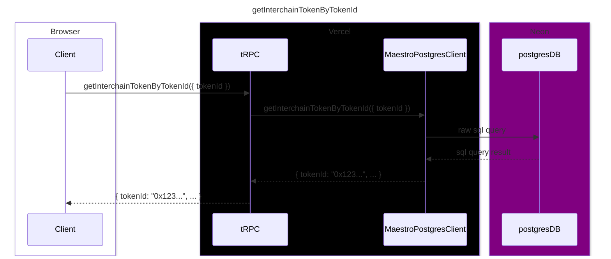

# Server

This directory contains the server-side code for the application. The server uses [tRPC](https://trpc.io) for communication between client and server. The server-side code is typically responsible for handling database interactions, business logic, and other server-side tasks.

The [routers](/apps/maestro/src/server/routers/) folder contains the router structure, routers are collections of tRPC procedures, which can be either `queries` (reads) or `mutations` (writes).

Query example: [trpc.interchainToken.getInterchainTokenByTokenId](/apps/maestro/src/server/routers/interchainToken/getInterchainTokenByTokenId.ts)

Mutation example: [trpc.interchainToken.recordInterchainTokenDeployment](/apps/maestro/src/server/routers/interchainToken/recordInterchainTokenDeployment.ts)

